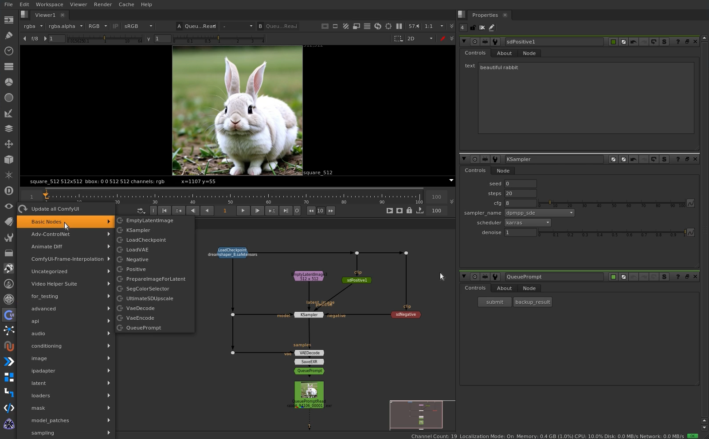

# ComfyUI for Nuke
API to be able to use ComfyUI nodes within nuke, only using the ComfyUI server

<div style="display: flex;">
  
</div>

## Requirements
1 - Nuke 12 or higher (Not tested on previous versions !)

2 - websocket-client

3 - <a href="https://github.com/comfyanonymous/ComfyUI" target="_blank">ComfyUI</a>

4 - ComfyUI-HQ-Image-Save (required to load images and sequences and work with EXR)


## Installation
1 - Copy to nuke folder
```sh
# Linux:
cd ~/.nuke
git clone --recursive https://github.com/vinavfx/ComfyUI-for-Nuke nuke_comfyui

# Windows
# Download git: https://git-scm.com/download/win
cd "C:\Users\<username>\.nuke"
git clone --recursive https://github.com/vinavfx/ComfyUI-for-Nuke nuke_comfyui

# Or manually copy the entire git downloaded folder and its
# submodules to the nuke user folder
```

2 - Install Websocket Client in python
```sh
# Websocket cannot be installed directly on Nuke, so the Python library of
# the operating system must be imported, and for that reason that version
# of the system's python version must be the same as that of 
# Nuke because different versions will not be compatible !

# Install websocket on your operating system python:
pip install websocket-client
# Example: python3.10 -m pip install websocket-client
```

3 - Copy this lines to <b>menu.py</b>
```python
# Include path where websocket-client was installed
# Windows: 'C:/Users/<USER>/AppData/Local/Programs/Python/Python37/Lib/site-packages'
nuke.pluginAddPath('/home/<USER>/.local/lib/python3.7/site-packages') # Linux

import nuke_comfyui as comfyui
comfyui.setup()
```

4 - Clone ComfyUI to any directory
```sh
git clone https://github.com/comfyanonymous/ComfyUI
```

5 - Install ComfyUI-HQ-Image-Save (required to work with EXR)
```sh
cd <ComfyUI Directory>/custom_nodes
git clone https://github.com/spacepxl/ComfyUI-HQ-Image-Save.git
cd ./ComfyUI-HQ-Image-Save
pip install -r requirements.txt
```

6 - Some nodes need additional repositories to work (Optional)
```sh
cd <ComfyUI Directory>/custom_nodes

# Upscale
git clone https://github.com/ssitu/ComfyUI_UltimateSDUpscale

# AnimateDiff
git clone https://github.com/Kosinkadink/ComfyUI-AnimateDiff-Evolved.git

# IPAdapter
git clone https://github.com/cubiq/ComfyUI_IPAdapter_plus

# Advanced ControlNet
git clone https://github.com/Kosinkadink/ComfyUI-Advanced-ControlNet.git

# LivePortrait
git clone https://github.com/kijai/ComfyUI-LivePortraitKJ.git
```

7 - Download some models 
```sh
cd <ComfyUI Directory>/models/checkpoints
wget https://huggingface.co/autismanon/modeldump/resolve/main/dreamshaper_8.safetensors

# to download more models on these pages !
# https://civitai.com
# https://huggingface.co
```

## Setup
1 - Run ComfyUI Server
```sh
cd <ComfyUI Directory>
python main.py
```


2 - Modify environment variables in [env.py](./env.py)

```python
COMFYUI_DIR = '<ComfyUI>'
IP = '127.0.0.1'
PORT = 8188
NUKE_USER = '<.../.nuke>' # Change only if your path is different !
```

## Tips
1 - When connecting any image or roto from Nuke, take into consideration the <b>'FrameRange'</b>
of the output because that will be the batch size.

2 - To make ComfyUI work with pixel values greater than 1 and less than 0, uncheck the <b>'sRGB_to_linear'</b> box in the <b>'SaveEXR'</b> node

3 - Latent images only work with formats with multiple of 8, add the '<b>PrepareImageForLatent</b>' node before passing the image 
to latent, and in the same node there is a button to create a restore node, put it on the image after inference to restore.

4 - To load all ComfyUI nodes when Nuke starts, change the '<b>update_menu_at_start</b>' variable in the [__init__.py](./__init__.py) file

5 - To use Switch on ComfyUI nodes use '<b>SwitchAny</b>' as ComfyUI switch nodes don't work
because they have 'any *' inputs and outputs, which is not possible on nuke because it doesn't have multiple outputs.

6 - If you want to have the ComfyUI server on another machine, you must share the folder where ComfyUI is installed and put the path in [env.py](./env.py)
