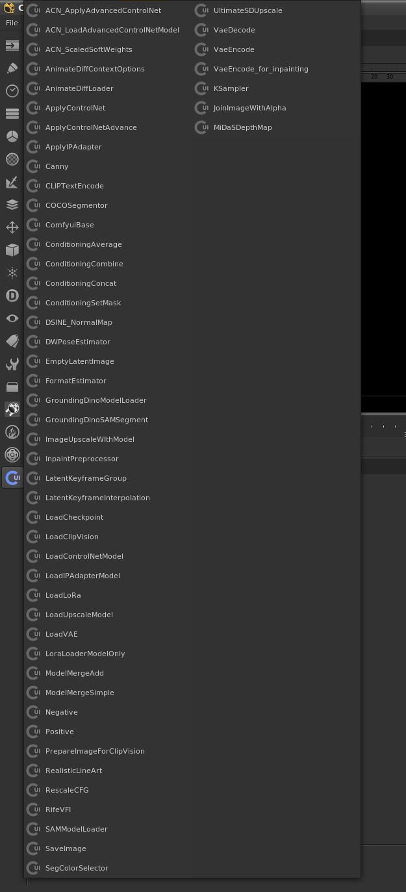
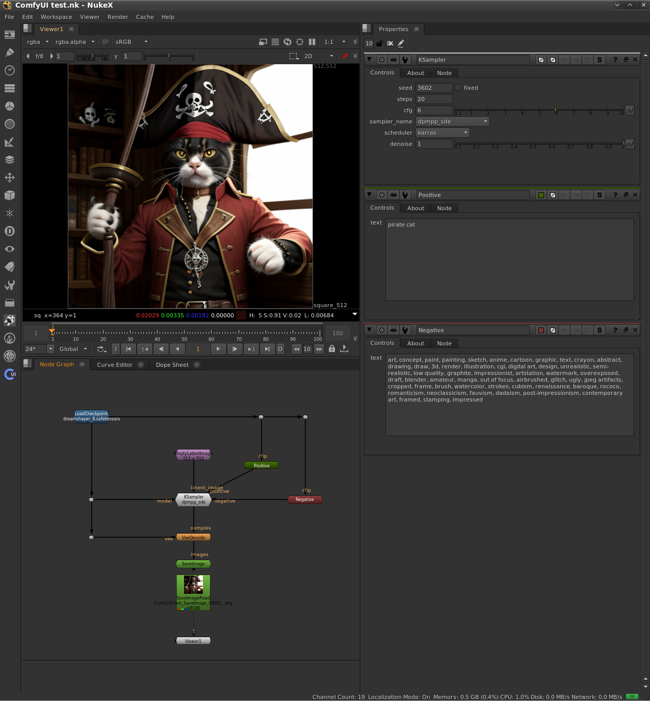
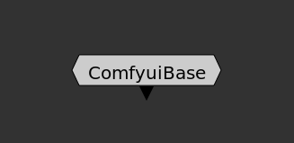
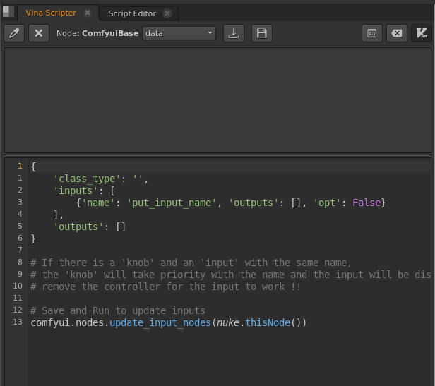

# Nuke - ComfyUI
API to be able to use ComfyUI nodes within nuke, only using the ComfyUI server




## Requirements
1 - Python 3.9 (only for comfyui, nuke works with any python)


## Installation
1 - Copy to nuke folder
```sh
# Linux:
cd ~/.nuke
git clone --recursive https://github.com/vinavfx/nuke_comfyui.git

# Windows
# Download git: https://git-scm.com/download/win
cd "C:\Users\<username>\.nuke"
git clone --recursive https://github.com/vinavfx/nuke_comfyui.git

# Or manually copy the entire git downloaded folder and its 
# submodules to the nuke user folder
```

2 - Copy this lines to <b>menu.py</b>
```python
import nuke_comfyui as comfyui
comfyui.setup()
```

3 - Clone ComfyUI to any directory
```sh
git clone https://github.com/comfyanonymous/ComfyUI
```

4 - Some nodes need additional repositories to work (Optional)
```sh
cd <ComfyUI Directory>/custom_nodes

# Upscale
git clone https://github.com/ssitu/ComfyUI_UltimateSDUpscale

# AnimateDiff
git clone https://github.com/Kosinkadink/ComfyUI-AnimateDiff-Evolved.git

# Video Nodes
git clone https://github.com/Kosinkadink/ComfyUI-VideoHelperSuite

# IPAdapter
git clone https://github.com/cubiq/ComfyUI_IPAdapter_plus

# Advanced ControlNet
git clone https://github.com/Kosinkadink/ComfyUI-Advanced-ControlNet.git
```

5 - Download some models 
```sh
cd <ComfyUI Directory>/models/checkpoints
wget https://huggingface.co/autismanon/modeldump/resolve/main/dreamshaper_8.safetensors

# to download more models on these pages !
# https://civitai.com
# https://huggingface.co
```

## Setup
1 - Run ComfyUI Server
```sh
cd <ComfyUI Directory>
python main.py
```


2 - Modify general variables in [settings.py](./settings.py)

```python
COMFYUI_DIR = '<ComfyUI>'
IP = '127.0.0.1'
PORT = 8188
```

## Nodes
Currently these [Nodes](./nodes) have been transferred from ComfyUI,
to transfer new nodes use 'ComfyuiBase' node as base
Since ComfyUI has multiple outputs and Nuke only has one output,
you use a knob called data and there are the outputs and you enter.




<b>class_type:</b> you have to set the exact class of the ComfyUI node, otherwise it won't work

<b>inputs:</b> is a list with all the inputs that the node
has, and each input has as an attribute the name of the input
and a list of 'outputs' that contains the names that are allowed to connect to that input,
and the 'opt' is to say if the node The input It is mandatory to connect.

<b>outputs:</b> is a list with all outputs that the node has since nuclear only has one

The <b>comfyui.nodes.update_input_nodes(nuke.thisNode())</b> function creates the node entries automatically depending on the list above
